# 2. Algebra

- **Algebra**: build set of objects and set of rule để thao tác trên các object này.

- **Linear Algebra**: làm việc với các object là vectors và các quy tắc nhất định (thường là cộng và nhân với scalar) để thao tác với các vector đó.

- In this book, we will use vector $\bold{x}$, $\bold{y}$

    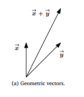

- **Polynomials** (đa thức) cũng được coi là vector, vì chúng có thể cộng lại với nhau ra đa thức, và nhân với scalar ra đa thức.
    - Tuy nhiên, polynomials khác với geometric vector, geometric vector là những bản vẽ cụ thể, còn polynomials là những khái niệm trừu tượng.

- **Audio signals**: cộng và nhân với scalar cũng thu được audio signals, nên coi là ***vector***.

- **Elements of** $\mathbb{R}^n$.

- Focus on vectors in $\mathbb{R}^n$.

## 2.1 Systems of Linear Equations.

- Fomular:

    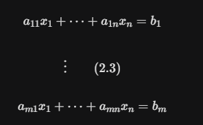

- Every tuple $(x_1,...,x_n) \in \mathbb{R}^n$ được gọi là solution của Systems of Linear Equations.

- Chúng ta có thể viết lại phương trình ***(2.3)*** lại như sau:

    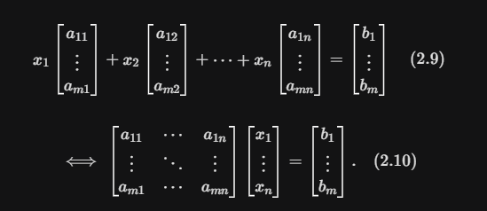

- Các nghiệm của hệ thường 1 trong 3 trường hợp:
    - Nghiệm duy nhất.
    - Vô nghiệm.
    - Vô số nghiệm.

## 2.2 Matrices

- Matrices đóng 1 vai trò center trong linear algebra.

- Matric is below

    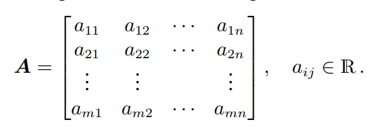

- **Row vector**: has size $(1, n)$
- **Column vector**: has size $(m, 1)$

- Cho $ \mathbb{R}^{m \times n} $ là tập hợp tất cả $(m,n)$-matrices mang giá trị thực.
    - Matric $\bold{A} \in \mathbb{R}^{m \times n} $ can biểu diễn tương đương dưới dạng vector $a \in \mathbb{R}^{mn}$ bằng cách xếp chồng (stacking) all n colmumns of this matric to a long vector.

    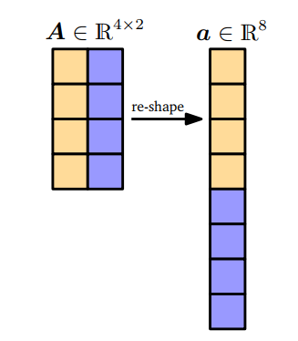

### 2.2.1 Matrix Addition and Multiplication

- Sum of $ \bold{A} \in \mathbb{R}^{m \times n} $ and $ \bold{B} \in \mathbb{R}^{m \times n} $ is sum of từng element tương ứng vị trí với nhau (element-wise sum).

    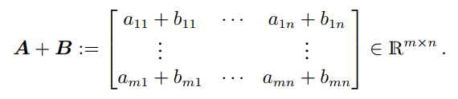

- Đối với matrices $\bold{A} \in \mathbb{R}^{m \times n}, \bold{B} \in \mathbb{R}^{n \times k}$, elements $ c_{ij}$ in tích $\bold{C} = \bold{AB} \in \mathbb{R}^{m \times k} $ tính bằng công thức:

    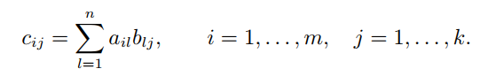

- Sau này chúng ta sẽ gọi là ***dot product*** ($\mathbf{A} . \mathbf{B}$).

- Thông thường, ***dot product*** giữa 2 vector $\mathbf{a},\mathbf{b}$ được ký hiệu là $ \mathbf{a}^{\intercal} . \mathbf{b}$ hoặc $ \langle a, b \rangle $.

- ***Remark***:

    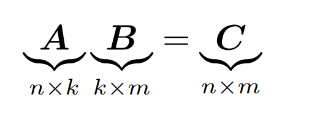

    - Không có tính giao hoán.

- In space $\mathbb{R}^{n \times n}$, ***indentity matrix*** $ I_n $:

    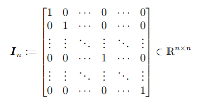

- **Properties**:
    - ***Associativity***:
        $ \forall \mathbf{A} \in \mathbb{R}^{m \times n}, \bold{B} \in \mathbb{R}^{n \times p}, \bold{C} \in \mathbb{R}^{p \times q}:(\bold{A}\bold{B})\bold{C} = \bold{A}(\bold{B}\bold{C}) $

    - ***Distributivity***:
        $\\ \forall \mathbf{A}, \bold{B} \in \mathbb{R}^{m \times n}, \mathbf{C}, \bold{D} \in \mathbb{R}^{n \times p}: \\$

        $ (\bold{A} + \bold{B})\bold{C} = \bold{A}\bold{C} + \bold{B}\bold{C} \\$

        $ \bold{A}(\bold{C}+\bold{D}) = \bold{A}\bold{C} + \bold{A}\bold{D} $

    - ***Multiplication with the identity matrix***:
    $\\ \forall \mathbf{A} \in \mathbb{R}^{m \times n}: \bold{I}_m\bold{A} = \bold{A}\bold{I}_n = \bold{A} \ \ (m \ne n)\\$

### 2.2.2 Inverse and Transpose

- **Definition:** Cho $\bold{A} \in \mathbb{R}^{n \times n} $, giả sử cho $\bold{B} $ sao cho $\bold{A}\bold{B}= \bold{I}_n = \bold{B}\bold{A} $.
    - Lúc này $\bold{B} $ gọi là **inverse** của $\bold{A} $. KH: $\bold{A}^{-1} $

- Không phải **matrix** nào cũng có **inverse matrix**.
    - Nếu tồn tại **inverse**, thì $\bold{A} $ gọi là ***regular / invertible / nonsingular***. Và nó là *duy nhất*
    - Nếu không, gọi là ***singular / noninvertible***.

- Xét 1 matrix (2,2):
$\bold{A} =
\begin{bmatrix}
a_{11}& a_{12}\\
a_{21}& a_{22}
\end{bmatrix} \in \mathbb{R}^{2 \times 2}
$
    - $\bold{A}^{-1} = \frac{1}{a_{11}a_{22} - a_{12}a_{21}} \begin{bmatrix} a_{22}& -a_{12}\\ -a_{21}& a_{11} \end{bmatrix} $
    - Nếu và chỉ nếu $a_{11}a_{22} - a_{12}a_{21} \ne 0$
    - Sau này, $a_{11}a_{22} - a_{12}a_{21}$ chính là **determinant**.

- **Definition:** Cho $\bold{A} \in \mathbb{R}^{m \times n}, \bold{B} \in \mathbb{R}^{n \times m} $ with $b_{ij} = a_{ji} $ được gọi là transpose của $\bold{A} $. 
    - $\bold{B} = \bold{A}^\intercal $

- **Important properties:**

    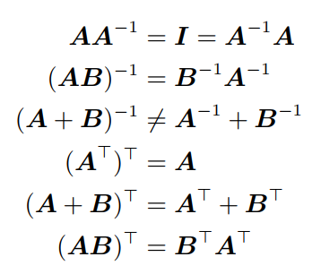

- **Definition**: $\bold{A} \in \mathbb{R}^{n \times n} $ and $\bold{A} = \bold{A}^{\intercal} $. Gọi là **Symmetric matrix**

    - Only $(n,n) $-matrics mới có thể là **symemtric**.
    - If $\bold{A} $ is **regular**, $\bold{A}^{\intercal} $ too.
        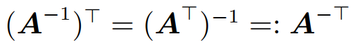

    - **Sum** of two symmetric is **always** symmetric, but multiple is not symmetric.

### 2.2.3 Multiplication by a Scalar

- Cho $\bold{A} \in \mathbb{R}^{m \times n}, \lambda \in \mathbb{R} $:
    - Khi đó $\lambda\bold{A} = \bold{K} $ with $\bold{K}_{ij} = \lambda a_{ij} $.
    - Về mặt thực tế, $\lambda$ sẽ là **scale** từng element của $\bold{A}$

- Đối với $\lambda, \psi \in \mathbb{R}$, các properties dưới đây luôn đúng:
    - **Associativity**:
        - $(\lambda\psi)\boldsymbol{C} = \lambda(\psi\boldsymbol{C}), \quad \boldsymbol{C} \in \mathbb{R}^{m \times n}$
        - $\lambda(\boldsymbol{B}\boldsymbol{C}) = (\lambda\boldsymbol{B})\boldsymbol{C} = \boldsymbol{B}(\lambda\boldsymbol{C}) = (\boldsymbol{B}\boldsymbol{C})\lambda, \quad \boldsymbol{B} \in \mathbb{R}^{m \times n}, \boldsymbol{C} \in \mathbb{R}^{n \times k}$.
        - $(\lambda\boldsymbol{C})^\top = \boldsymbol{C}^\top\lambda^\top = \boldsymbol{C}^\top\lambda = \lambda\boldsymbol{C}^\top$ bởi vì $\lambda = \lambda^\top$ đối với mọi $\lambda \in \mathbb{R}$.
    - **Distributivity**:
        - $(\lambda + \psi)\boldsymbol{C} = \lambda\boldsymbol{C} + \psi\boldsymbol{C}, \quad \boldsymbol{C} \in \mathbb{R}^{m \times n}$
        - $\lambda(\boldsymbol{B} + \boldsymbol{C}) = \lambda\boldsymbol{B} + \lambda\boldsymbol{C}, \quad \boldsymbol{B}, \boldsymbol{C} \in \mathbb{R}^{m \times n}$

### 2.2.4 Compact Representations (Biểu diễn thu gọn) of Systems of Linear Equations

- Nếu chúng ta xem xét system of linear equations:
$\\ 
\begin{cases}
2x_1 + 3x_2 + 5x_3 = 1 \\
4x_1 - 2x_2 - 7x_3 = 8 \\
9x_1 + 5x_2 - 3x_3 = 2
\end{cases}
$

- và sử dụng quy tắc matrix multiplication, chúng ta có thể viết:
$ \\
\begin{bmatrix} 
2 & 3 & 5 \\ 
4 & -2 & -7 \\ 
9 & 5 & -3 
\end{bmatrix}
\begin{bmatrix} 
x_1 \\ x_2 \\ x_3 
\end{bmatrix} = 
\begin{bmatrix}
1 \\ 8 \\ 2 
\end{bmatrix}.
$

- Nói chung, một system of linear equations có form $\boldsymbol{A}\boldsymbol{x}=\boldsymbol{b} $ và tích $\boldsymbol{A}\boldsymbol{x}$ là một ***(linear) combination*** của các cột của $\boldsymbol{A} $.

## 2.3 Solving Systems of Linear Equations

### 2.3.1 Particular and General Solution / Nghiệm riêng và nghiệm tổng quát

1. Tìm particular solution của hệ $\boldsymbol{Ax=b} $

2. Tìm tất cả các solution của hệ thuần nhất $\boldsymbol{Ax=0} $

3. ***General Solution = Particular + general of hệ thuần nhất.***

- Tuy nhiên, các matrics thường cần phải trải qua bước **Gaussian elimination**, rồi mới có thể áp dụng 3 bước trên.