# 2. Algebra

- **Algebra**: build set of objects and set of rule để thao tác trên các object này.

- **Linear Algebra**: làm việc với các object là vectors và các quy tắc nhất định (thường là cộng và nhân với scalar) để thao tác với các vector đó.

- In this book, we will use vector $\bold{x}$, $\bold{y}$

    

- **Polynomials** (đa thức) cũng được coi là vector, vì chúng có thể cộng lại với nhau ra đa thức, và nhân với scalar ra đa thức.
    - Tuy nhiên, polynomials khác với geometric vector, geometric vector là những bản vẽ cụ thể, còn polynomials là những khái niệm trừu tượng.

- **Audio signals**: cộng và nhân với scalar cũng thu được audio signals, nên coi là ***vector***.

- **Elements of** $\mathbb{R}^n$.

- Focus on vectors in $\mathbb{R}^n$.

## 2.1 Systems of Linear Equations.

- Fomular:

    

- Every tuple $(x_1,...,x_n) \in \mathbb{R}^n$ được gọi là solution của Systems of Linear Equations.

- Chúng ta có thể viết lại phương trình ***(2.3)*** lại như sau:

    

- Các nghiệm của hệ thường 1 trong 3 trường hợp:
    - Nghiệm duy nhất.
    - Vô nghiệm.
    - Vô số nghiệm.

## 2.2 Matrices

- Matrices đóng 1 vai trò center trong linear algebra.

- Matric is below

    

- **Row vector**: has size $(1, n)$
- **Column vector**: has size $(m, 1)$

- Cho $ \mathbb{R}^{m \times n} $ là tập hợp tất cả $(m,n)$-matrices mang giá trị thực.
    - Matric $\bold{A} \in \mathbb{R}^{m \times n} $ can biểu diễn tương đương dưới dạng vector $a \in \mathbb{R}^{mn}$ bằng cách xếp chồng (stacking) all n colmumns of this matric to a long vector.

    

### 2.2.1 Matrix Addition and Multiplication

- Sum of $ \bold{A} \in \mathbb{R}^{m \times n} $ and $ \bold{B} \in \mathbb{R}^{m \times n} $ is sum of từng element tương ứng vị trí với nhau (element-wise sum).

    

- Đối với matrices $\bold{A} \in \mathbb{R}^{m \times n}, \bold{B} \in \mathbb{R}^{n \times k}$, elements $ c_{ij}$ in tích $\bold{C} = \bold{AB} \in \mathbb{R}^{m \times k} $ tính bằng công thức:

    

- Sau này chúng ta sẽ gọi là ***dot product*** ($\mathbf{A} . \mathbf{B}$).

- Thông thường, ***dot product*** giữa 2 vector $\mathbf{a},\mathbf{b}$ được ký hiệu là $ \mathbf{a}^{\intercal} . \mathbf{b}$ hoặc $ \langle a, b \rangle $.

- ***Remark***:

    

    - Không có tính giao hoán.

- In space $\mathbb{R}^{n \times n}$, ***indentity matrix*** $ I_n $:

    

- **Properties**:
    - ***Associativity***:
        $ \forall \mathbf{A} \in \mathbb{R}^{m \times n}, \bold{B} \in \mathbb{R}^{n \times p}, \bold{C} \in \mathbb{R}^{p \times q}:(\bold{A}\bold{B})\bold{C} = \bold{A}(\bold{B}\bold{C}) $

    - ***Distributivity***:
        $\\ \forall \mathbf{A}, \bold{B} \in \mathbb{R}^{m \times n}, \mathbf{C}, \bold{D} \in \mathbb{R}^{n \times p}: \\$

        $ (\bold{A} + \bold{B})\bold{C} = \bold{A}\bold{C} + \bold{B}\bold{C} \\$

        $ \bold{A}(\bold{C}+\bold{D}) = \bold{A}\bold{C} + \bold{A}\bold{D} $

    - ***Multiplication with the identity matrix***:
    $\\ \forall \mathbf{A} \in \mathbb{R}^{m \times n}: \bold{I}_m\bold{A} = \bold{A}\bold{I}_n = \bold{A} \ \ (m \ne n)\\$

### 2.2.2 Inverse and Transpose

- **Definition:** Cho $\bold{A} \in \mathbb{R}^{n \times n} $, giả sử cho $\bold{B} $ sao cho $\bold{A}\bold{B}= \bold{I}_n = \bold{B}\bold{A} $.
    - Lúc này $\bold{B} $ gọi là **inverse** của $\bold{A} $. KH: $\bold{A}^{-1} $

- Không phải **matrix** nào cũng có **inverse matrix**.
    - Nếu tồn tại **inverse**, thì $\bold{A} $ gọi là ***regular / invertible / nonsingular***. Và nó là *duy nhất*
    - Nếu không, gọi là ***singular / noninvertible***.

- Xét 1 matrix (2,2):
$\bold{A} =
\begin{bmatrix}
a_{11}& a_{12}\\
a_{21}& a_{22}
\end{bmatrix} \in \mathbb{R}^{2 \times 2}
$
    - $\bold{A}^{-1} = \frac{1}{a_{11}a_{22} - a_{12}a_{21}} \begin{bmatrix} a_{22}& -a_{12}\\ -a_{21}& a_{11} \end{bmatrix} $
    - Nếu và chỉ nếu $a_{11}a_{22} - a_{12}a_{21} \ne 0$
    - Sau này, $a_{11}a_{22} - a_{12}a_{21}$ chính là **determinant**.

- **Definition:** Cho $\bold{A} \in \mathbb{R}^{m \times n}, \bold{B} \in \mathbb{R}^{n \times m} $ with $b_{ij} = a_{ji} $ được gọi là transpose của $\bold{A} $. 
    - $\bold{B} = \bold{A}^\intercal $

- **Important properties:**

    

- **Definition**: $\bold{A} \in \mathbb{R}^{n \times n} $ and $\bold{A} = \bold{A}^{\intercal} $. Gọi là **Symmetric matrix**

    - Only $(n,n) $-matrics mới có thể là **symemtric**.
    - If $\bold{A} $ is **regular**, $\bold{A}^{\intercal} $ too.
        

    - **Sum** of two symmetric is **always** symmetric, but multiple is not symmetric.

### 2.2.3 Multiplication by a Scalar

- Cho $\bold{A} \in \mathbb{R}^{m \times n}, \lambda \in \mathbb{R} $:
    - Khi đó $\lambda\bold{A} = \bold{K} $ with $\bold{K}_{ij} = \lambda a_{ij} $.
    - Về mặt thực tế, $\lambda$ sẽ là **scale** từng element của $\bold{A}$

- Đối với $\lambda, \psi \in \mathbb{R}$, các properties dưới đây luôn đúng:
    - **Associativity**:
        - $(\lambda\psi)\boldsymbol{C} = \lambda(\psi\boldsymbol{C}), \quad \boldsymbol{C} \in \mathbb{R}^{m \times n}$
        - $\lambda(\boldsymbol{B}\boldsymbol{C}) = (\lambda\boldsymbol{B})\boldsymbol{C} = \boldsymbol{B}(\lambda\boldsymbol{C}) = (\boldsymbol{B}\boldsymbol{C})\lambda, \quad \boldsymbol{B} \in \mathbb{R}^{m \times n}, \boldsymbol{C} \in \mathbb{R}^{n \times k}$.
        - $(\lambda\boldsymbol{C})^\top = \boldsymbol{C}^\top\lambda^\top = \boldsymbol{C}^\top\lambda = \lambda\boldsymbol{C}^\top$ bởi vì $\lambda = \lambda^\top$ đối với mọi $\lambda \in \mathbb{R}$.
    - **Distributivity**:
        - $(\lambda + \psi)\boldsymbol{C} = \lambda\boldsymbol{C} + \psi\boldsymbol{C}, \quad \boldsymbol{C} \in \mathbb{R}^{m \times n}$
        - $\lambda(\boldsymbol{B} + \boldsymbol{C}) = \lambda\boldsymbol{B} + \lambda\boldsymbol{C}, \quad \boldsymbol{B}, \boldsymbol{C} \in \mathbb{R}^{m \times n}$

### 2.2.4 Compact Representations (Biểu diễn thu gọn) of Systems of Linear Equations

- Nếu chúng ta xem xét system of linear equations:
$\\ 
\begin{cases}
2x_1 + 3x_2 + 5x_3 = 1 \\
4x_1 - 2x_2 - 7x_3 = 8 \\
9x_1 + 5x_2 - 3x_3 = 2
\end{cases}
$

- và sử dụng quy tắc matrix multiplication, chúng ta có thể viết:
$ \\
\begin{bmatrix} 
2 & 3 & 5 \\ 
4 & -2 & -7 \\ 
9 & 5 & -3 
\end{bmatrix}
\begin{bmatrix} 
x_1 \\ x_2 \\ x_3 
\end{bmatrix} = 
\begin{bmatrix}
1 \\ 8 \\ 2 
\end{bmatrix}.
$

- Nói chung, một system of linear equations có form $\boldsymbol{A}\boldsymbol{x}=\boldsymbol{b} $ và tích $\boldsymbol{A}\boldsymbol{x}$ là một ***(linear) combination*** của các cột của $\boldsymbol{A} $.

## 2.3 Solving Systems of Linear Equations

### 2.3.1 Particular and General Solution / Nghiệm riêng và nghiệm tổng quát

1. Tìm particular solution của hệ $\boldsymbol{Ax=b} $

2. Tìm tất cả các solution của hệ thuần nhất $\boldsymbol{Ax=0} $

3. ***General Solution = Particular + general of hệ thuần nhất.***

- Tuy nhiên, các matrics thường cần phải trải qua bước **Gaussian elimination**, rồi mới có thể áp dụng 3 bước trên.

### 2.3.2. Các phép biến đổi sơ cấp

- Đặc điểm:
    - Giữ nguyên **tập nghiệm** của hệ.
    - Biến đổi hệ sang dạng simple hơn.

- How?
    - Đổi chỗ 2 phương trình.
    - Multiplication với hằng số khác 0. $\lambda \in \mathbb{R} \setminus \{0\}  $
    - Cộng 2 phương trình với nhau.

- Example: Với $a \in \mathbb{R} $ Tìm tất cả nghiệm của hệ:

    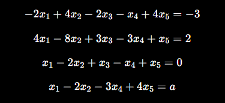

    - Convert ma trận gọn: $\boldsymbol{Ax=b} $
    - Build **augmented matrix** (ma trận mở rộng): $[\boldsymbol{A|b}]$

        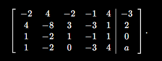

    - Biến đổi sang hệ pt tương đương: $[\boldsymbol{A|b}] \sim [\boldsymbol{A'|b'}] $

    - Sau khi biến đổi sơ cấp, ta thu được:
        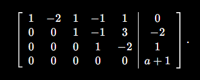

    - This matric is **row-echelon form (REF)**
    - Suy ra được **particular and general solution**:
        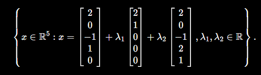
    - Phương pháp tìm **particular and general solution** sẽ trình bày sau.

- **Nhận xét: Pivot và cấu trúc bậc thang**:
    - **Leading coefficient** của một hàng, tức là số khác 0 đầu tiên tính từ bên trái của hàng đó, được gọi là **pivot**.

- **Row-Echelon Form**:
    - **Rows full 0** phải nằm ở dưới cùng.
    - Pivot của below row phải nằm bên phải pivot của hàng trên.

- **Basic and Free variable**:
    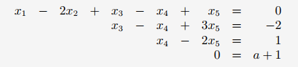
    - **Basic variable** là các biến tương ứng với pivot trong **row-echelon form** $x_1, x_3,x_4 $.
    - Còn lại là **free variable** $x_2, x_5 $.

    - Ý nghĩa:
        - **Basic variable** sẽ biểu diễn theo **free variable**.
        - **Free variable** có thể nhận giá trị tùy ý.
        - Chính các **free variable** tạo ra ***vô số nghiệm***.

- **How to find Particular solution**:
    - Dựa vào **row-echelon form**, ta biết được $x_i$ là **pivot**.
    - Sau đó, tìm $\lambda_i $ sao cho $\sum_{i}^{p} \lambda_i.column_i(chứa \ \  pivot_i) $
        - $p$: số lượng **pivot**.
        - Ex:
            
            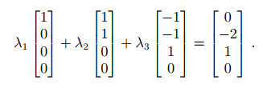
            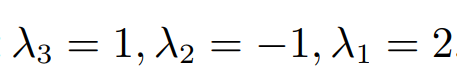
        - Như vậy ta được **particular solution**: $x=[2,0,-1,1,0]^{\intercal}$

- Nhận biết **Reduced Row-Echelon Form** / **row-reduced echelon form** / **row canonical form**:
    - Nó ở **row-echelon form**.
    - Mọi **pivot** đều bằng 1.
    - **Pivot** là phần tử khác 0 duy nhất trong cột của nó.
        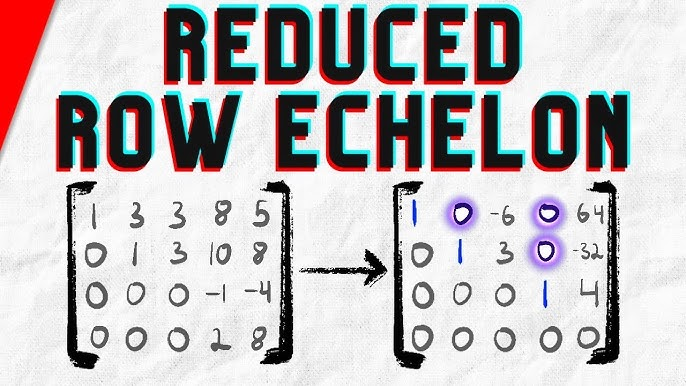

    - Vai trò:
        - Cho phép ta xác định **general solution** của một **system of linear equation** một cách trực tiếp và rõ ràng.

- **Gaussian Elimination**:
    - Là algorithm thực hiện các **elemantary transformations** để đưa **system of linear equation** về **reduced row-echelon form**.

### 2.3.3 The Minus-Trick

- "Mẹo" thực tế để đọc trực tiếp nghiệm $x $ của **homogeneous system**: $\boldsymbol{Ax=0} $:
    - Trong đó: $\boldsymbol{A} \in \mathbb{R}^{k \times n} $, $x \in \mathbb{R}^n $.

    - First, equation phải có dạng **reduce row-echelon form (RREF)**.
    - Add $n-k $ rows để matrix có dạng $(n,n) $
        - row: $[0 ... 0 -1\ \ 0...0] $
        - Sao cho đường chéo chính only 1 or -1.

    - Lúc này, nghiệm chính là các cột chứa $pivot=-1$
        - Các cột này là **basis** của **không gian nghiệm** của $\boldsymbol{Ax=0} $.

    - Ex: Cho $\boldsymbol{A} $ đã có dạng RREF:
        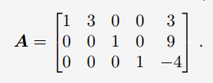
    - Thêm các row $[0 ... 0 -1\ \ 0...0] $ sao cho A vuông:
        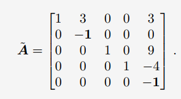
    - Lấy các column chứa $pivot=-1$ trên đường chéo:
        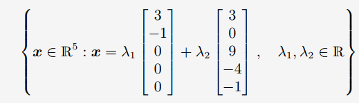

- **Calculating the Inverse**:
    - Ta sử dụng **augumented matrix notation**:$$ [\boldsymbol{A|I_n}] $$
    - và dùng Gaussian elimination biến đổi thành: $$[\boldsymbol{I_n|A^{-1}}] $$

### 2.3.4 Algorithms for Solving a System of Linear Equations
- Giải hệ *(Giả sử hệ tồn tại nghiệm)* có dạng: $$\boldsymbol{Ax=b} $$

1. Nếu hệ **không có nghiệm chính xác**, ta cần tìm ***approximate solutions***. (Có thể dùng **linear regression**).

2. Ý tưởng dùng **inverse matrix**, khi đó nghiệm: $$\boldsymbol{x = A^{-1}b} $$

    - Nhưng cách này chỉ dùng được khi **A is square matrix** và tồn tại **inverse matrix**. Thực tế thì khác!.

3. Nếu các column của $\boldsymbol{A}$ **linearly independent** thì có thể biến đổi: $$\boldsymbol{A}^{\top}Ax = \boldsymbol{A}^{\top}b \\ \rightarrow \boldsymbol{x = (A^{\top}A)^{-1}A^{\top}b} $$ 
    - $\boldsymbol{(A^{\top}A)^{-1}}A^{\top} $ gọi là **Moore–Penrose pseudo-inverse**.
    - Nhưng nhược điểm **tốn nhiều tài nguyên tính toán**.

4. **Gaussian Elimination**
    - Nếu hệ có **hàng triệu biến** thì Gaussian Elimination trở  nên không thực tế $O(n^3) $.
    - Thực tế, các hệ lớn thường giải bằng **iterative methods**.

5. **Iterative methods**
    - Giả sử $\boldsymbol{x^*} $ là nghiệm thật của $\boldsymbol{Ax=b} $
    - Các method iterative sẽ tìm ra dãy nghiệm gần đúng: $\boldsymbol{x^{(0)},x^{(1)},x^{(2)}},... $ theo công thức: $$\boldsymbol{x^{(k+1)} = Cx^{(k)} + d} $$
        - $\boldsymbol{C}:$ matrix điểu khiển cách cập nhật.
        - $\boldsymbol{d}: $ vector hằng số.
    - Mục tiêu:
        - Qua mỗi lần lặp, sai số $||\boldsymbol{x^{k+1} - x_*} || $ sẽ giảm dần.
        - Finally $\boldsymbol{x^{k} \rightarrow x_* } $

## 2.4 Vector Spaces

- **Vector space**: 1 **không gian có cấu trúc** nơi vector "sống" trong đó.

### 2.4.1 Groups

- Xét 1 set $\mathcal{G} $ và 1 phép toán $\otimes :\mathcal{G} \times \mathcal{G} \rightarrow \mathcal{G} $.
- Khi đó $\mathcal{G} := (\mathcal{G}, \otimes) $ được gọi là **group** nếu thỏa mãn:
    1. **Closure** (tính đóng):
        - $ \forall x, y \in \mathcal{G} : x \otimes y \in \mathcal{G} $

    2. **Associativity** (tính kết hợp):
        - $\forall x, y, z \in \mathcal{G} : (x \otimes y) \otimes z = x \otimes (y \otimes z) $

    3. **Neutral element**:
        - $\exists e \in \mathcal{G} $ sao cho $x \otimes e = x $ and $e \otimes x = x $

    4. **Inverse elements**:
        - $\exists x \in \mathcal{G}, \exists y \in \mathcal{G} $ sao cho $x \otimes y = e $ and $y \otimes x = e $.
        - Thường viết $x^{-1} $ là inverse của x.

- **Abelian group**: 
    - If $x \otimes y = y \otimes x $ with $\forall x,y \in \mathcal{G} $ then $\mathcal{G} := (\mathcal{G}, \otimes) $ is an **Abelian group**.

- Trong trường hợp mọi matrix đều có inverse thì gọi là **General Linear Group**.

- Tất cả inverse matrix $\boldsymbol{A} \in \mathbb{R}^{n \times n} $ tạo thành 1 group dưới phép nhân matrix, group này là $GL(n, \mathbb{R}) $.